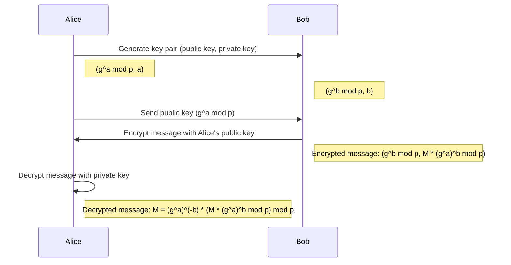

# Unlocking the Power of ElGamal Encryption: Implementing and Enhancing Security with SageMath

ElGamal encryption is a widely-used public key encryption algorithm that provides confidentiality and security in communication systems. It was proposed by Taher ElGamal in 1985 and is based on the Diffie-Hellman key exchange protocol. In this guide, I will walk through the key components of the ElGamal encryption scheme, including key generation, encryption, and decryption. I will also demonstrate how to implement the algorithm using the SageMath software and enhance the security of the system by using a 256-bit random prime number.

# ElGamal Encryption 

Key Components The ElGamal encryption scheme consists of three main components:
- Key Generation: The process of generating a pair of public and private keys for the encryption and decryption process.
- Encryption: The process of transforming plaintext into ciphertext using the public key.
- Decryption: The process of recovering the plaintext from the ciphertext using the private key.

In ElGamal encryption, the public key is used for encrypting the message, while the private key is used for decrypting it. The security of the ElGamal encryption scheme is based on the difficulty of solving the discrete logarithm problem.

Let's consider an example of the ElGamal encryption process:

- Alice and Bob agree on a large prime number $p$ and a primitive root $g$  modulo  $p$.
- Bob chooses a random private key $x$ and computes his public key $Y = g^x$  mod  $p$.
- Alice wants to send a message $M$ to Bob. She chooses a random integer $k$ and computes the ciphertext $(a, b) = (g^k$ mod $p$, $M * Y^k$ mod $p)$.
- Bob receives the ciphertext and decrypts it using his private key: $M=\frac{b}{a^x} \pmod p$.

**Flow of the ElGamal encryption**

The full article can be found at [thogiti.github.io](https://thogiti.github.io/unlocking-the-power-of-elgamal-encryption-implementing-and-enhancing-security-with-sagemath/).

You can find the full code in the github repo [github.com/thogiti](https://github.com/thogiti/ElGamal-Encryption/blob/main/ElGamal-Encryption.sage).

